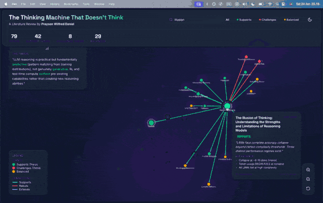

# The Thinking Machine That Doesn't Think

> **A systematic literature review on LLM reasoning capabilities**

[](https://proteusiq.github.io/unthinking/)
[]()
[]()

## Thesis

**LLM reasoning is practical but fundamentally predictive — pattern matching from training distributions, not genuinely generative reasoning.**

RL and test-time compute "surface" pre-existing capabilities rather than creating new reasoning abilities. Models excel within their training distribution but fail systematically on out-of-distribution compositions.

---

## Interactive Visualization

Explore the paper network: **[proteusiq.github.io/unthinking](https://proteusiq.github.io/unthinking/)**

<p align="center">
  <a href="https://proteusiq.github.io/unthinking/">
    
  </a>
</p>

<p align="center">
  
  
  
</p>

### Features
- **Force-directed graph** — papers as nodes, relationships as edges
- **Color-coded stances** — green (supports), red (challenges), yellow (balanced)
- **Relationship types** — supports, rebuts, extends
- **Interactive** — hover tooltips, click for details, search, filter
- **Dark/light mode** — toggle theme

---

## Key Findings

### Evidence Supporting the Thesis

| Finding | Papers | Key Evidence |
|---------|--------|--------------|
| **ID/OOD Gap** | Faith & Fate, CoT Mirage, Planning Gap | ~100% in-distribution → ~0% out-of-distribution |
| **Complexity Collapse** | Illusion of Thinking, Until They Don't | Abrupt failure at complexity thresholds (~8 disks Hanoi) |
| **CoT Unfaithfulness** | Measuring Faithfulness, Don't Say What They Think | 25-60% of CoT doesn't reflect actual computation |
| **RL Surfaces, Doesn't Create** | Interplay, No Free Lunch | 0% exposure → RL fails; RL amplifies existing patterns |
| **Compositional Failure** | OMEGA, Compositional-ARC | >69% isolated skills → near-0% when composed |

### Counter-Evidence (Steel-manned)

| Challenge | Papers | Limitation |
|-----------|--------|------------|
| Emergent reasoning via RL | DeepSeek-R1 | "Aha moments" are rare (~2-6%), don't improve accuracy |
| Tool use reverses collapse | Thinking Isn't Illusion | Move validator still yields 0% — planning is bottleneck |
| Test-time scaling works | s1 | 1K samples can't teach AIME math — surfaces pre-existing |

---

## Repository Structure

```
├── analysis/
│   ├── SYNTHESIS.md          # Main thesis synthesis
│   ├── PAPER_GRAPH.md        # Paper interaction graph
│   ├── REBUTTALS.md          # Rebuttal matrix
│   └── explored/             # Individual paper analyses (79 files)
├── docs/                     # Interactive visualization (GitHub Pages)
│   ├── index.html
│   ├── css/styles.css
│   └── js/
│       ├── graph.js
│       └── data.js
├── papers/
│   └── paper_list.md         # Master paper list with status
└── AGENTS.md                 # Literature review methodology
```

---

## Paper Clusters

| Cluster | Focus | Example Papers |
|---------|-------|----------------|
| **Compositional** | OOD generalization, skill composition | Faith & Fate, OMEGA, CoT Mirage |
| **Complexity** | Scaling limits, collapse thresholds | Illusion of Thinking, Comprehension Without Competence |
| **Faithfulness** | CoT reliability, reasoning transparency | Measuring Faithfulness, Don't Say What They Think |
| **Mechanism** | How RL/training affects reasoning | Interplay, No Free Lunch, Complex Network |
| **Emergence** | Claims of emergent reasoning | DeepSeek-R1, Strategic Reasoning |
| **Tools** | Agentic approaches, tool augmentation | Thinking Isn't Illusion, Limits Agentic |

---

## Methodology

1. **Read full papers** — not just abstracts (arXiv HTML versions)
2. **Independent critical assessment** — form own view before accepting characterizations
3. **Mandatory rebuttal analysis** — every paper checked for counter-evidence
4. **Quantitative evidence** — extract specific numbers, not just claims
5. **Track paper interactions** — who rebuts whom, chains of rebuttals

See [AGENTS.md](./AGENTS.md) for detailed methodology.

---

## Author

**Prayson Wilfred Daniel**

---

## Citation

```bibtex
@misc{daniel2026unthinking,
  author = {Daniel, Prayson Wilfred},
  title = {The Thinking Machine That Doesn't Think: A Systematic Literature Review on LLM Reasoning},
  year = {2026},
  url = {https://github.com/Proteusiq/unthinking}
}
```

---

## License

This literature review and visualization are provided for academic and research purposes.
